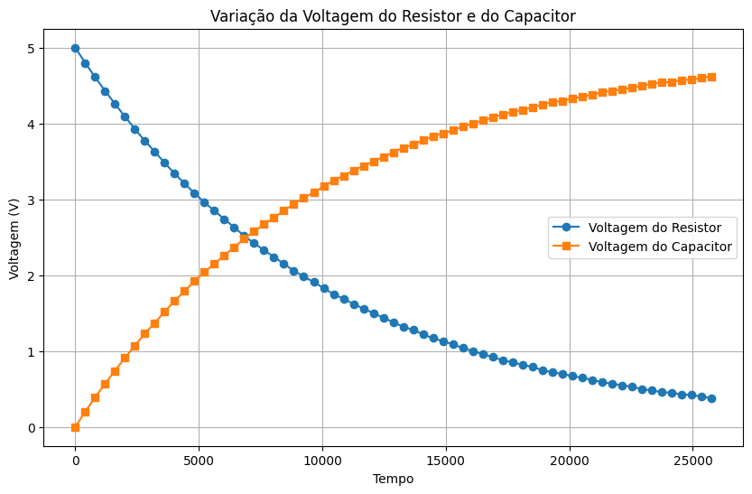

# Atividade Ponderada de Programação - Semana 2 - Aula 1

## Rafael Santana Rodrigues - T15 - Grupo 3
 
### Preposição:

Explique, com base no comportamento observado no gráfico e nos conceitos de tempo de carga e descarga, por que o circuito RC é capaz de eliminar os repiques (bouncing) de um botão e, ao mesmo tempo, filtrar ruídos vindos de sensores piezoelétricos.

### Gráfico:

### Resposta:

O circuito RC elimina os repiques de um botão e filtra ruidos de sensores piezoelétricos devido ao comportamento do capacitor em relação ao tempo de carga e descarga. O capacitor no circuito RC funciona como um filtro passa-baixa (comentado em aula), permitindo apenas sinais de baixa frequência passarem, enquanto atenua sinais de alta frequência, como os repiques e ruídos. Quando o botão é pressionado, o capacitor começa a carregar, mas devido ao tempo constante do circuito RC, ele não responde imediatamente as rápidas variações causadas pelos repiques. Isso resulta em um sinal de saída mais estável e livre de oscilações indesejadas. Além disso, os sensores piezoelétricos podem gerar ruídos de alta frequência devido a vibrações ou impactos. O circuito RC filtra esses ruídos, permitindo que apenas os sinais de baixa frequência, que são mais relevantes para a aplicação, sejam transmitidos. 

Levando em consideração o gráfico observado, podemos ver que o tempo de carga do capacitor se equipara ao tempo de descarga do resistor, o que reforça a capacidade do circuito RC de suavizar variações rápidas no sinal, eliminando repiques e filtrando ruídos eficazmente. Por essas variações de voltagem serem mais suaves e lentas, o circuito RC consegue estabilizar o sinal de saída. 